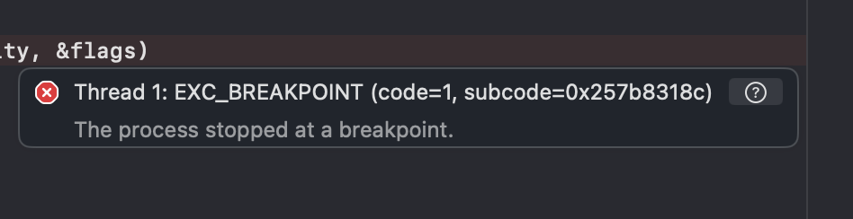

# Xcode26Crash Sample Project

This repository demonstrates a minimal iOS app (`Sample`) that uses a custom Swift framework (`TestFramework`). 

It is structured to reproduce or investigate issues related to Xcode 26 Beta 1 and the `Network` + `SystemConfiguration` frameworks. The project demonstrates a crash at launch when trying to access `URLSessionConfiguration` properties, such as `ephemeral` or `default`.



## Project Structure

```
Xcode26Crash.xcworkspace/      # Main workspace including both projects
Sample/                       # iOS app project
  Sample/
    AppDelegate.swift         # Where it calls the method that triggers the crash
    AppView.swift
    MainApp.swift
    Assets.xcassets/
    Preview Content/
  Sample.xcodeproj/
TestFramework/                # Custom Swift framework project
  TestFramework/
    Source/
      ConnectionUtils.swift   # It imports the SystemConfiguration framework
      NetworkChecker.swift    # It imports the Network framework
      TestFramework.h
    Resources/
  TestFramework.xcodeproj/
```

## Components

### Sample App

- **Entry Point:** [`MainApp.swift`](Sample/Sample/MainApp.swift)
- **App Delegate:** [`AppDelegate.swift`](Sample/Sample/AppDelegate.swift)  
  Uses `NetworkChecker.shared.isConnected` from the framework. - **This call triggers the crash**
- **UI:** [`AppView.swift`](Sample/Sample/AppView.swift)

### TestFramework

- **NetworkChecker:** [`NetworkChecker.swift`](TestFramework/TestFramework/Source/NetworkChecker.swift)  
  Provides network reachability status using `Network`.
- **ConnectionUtils:** [`ConnectionUtils.swift`](TestFramework/TestFramework/Source/ConnectionUtils.swift)  
  Utility for determining connection type (WiFi, cellular, none) using `SystemConfiguration`.

## Requirements

- Xcode 26 Beta 1
- iOS 26 Beta 1 Simulator

## Building & Running

1. Open [`Xcode26Crash.xcworkspace`](Xcode26Crash.xcworkspace/) in Xcode.
2. Select the `Sample` scheme.
3. Build and run on a simulator.

## Notes

- You can work around the issue by importing and explicitly calling ANY method from the `Network` framework at the top of the `didFinishLaunchingWithOptions` method (e.g., `nw_tls_create_options()`).

## License

This project is provided for demonstration and debugging purposes.